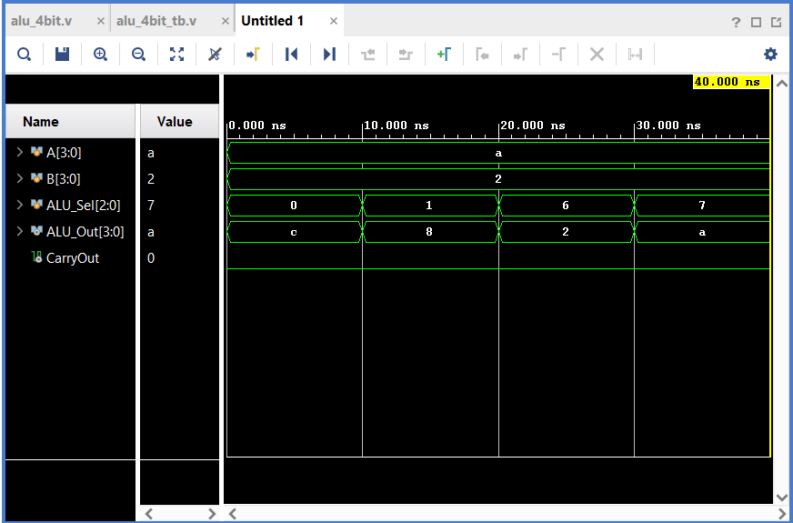

# Digital-Logic-Design
## 📌 Overview
This repository contains a collection of digital logic circuits and architectures designed, coded, and simulated as part of my B.Tech ECE coursework. The primary objective is to verify complex hardware behavior using hardware description languages before physical implementation.

## 🛠️ Tech Stack
* **Language:** Verilog (HDL)
* **Simulation Tool:** Xilinx Vivado

## 📁 Projects Included
* **4-Bit ALU Design:** Structural and behavioral modeling of an Arithmetic Logic Unit.

## 📊 Simulation Results

## 🚀 How to Run
1. Clone this repository.
2. Open Xilinx Vivado and create a new RTL project.
3. Add the `.v` files as design and simulation sources.
4. Run Behavioral Simulation.
